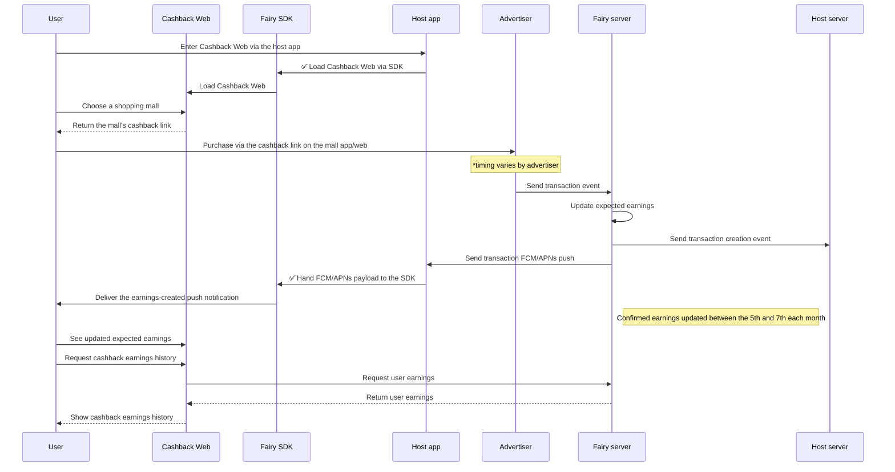
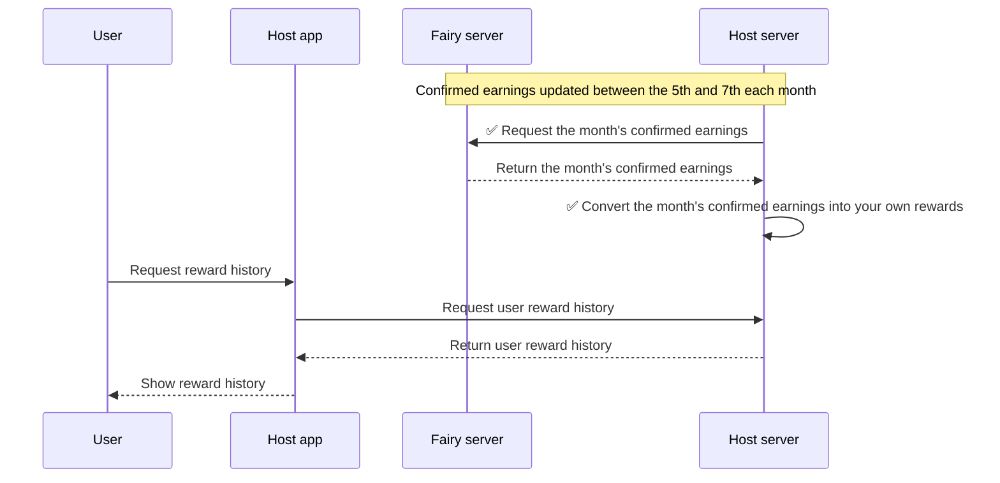

Fairy's Cashback solution ships as \*\*four main components (Cashback Web, Android SDK, Server API, Web Console)\*\* that plug into your app.

Users get cashback naturally within their shopping flow, and you get higher in-app conversion and satisfaction.

<Note>
  Cashback requires the **X Consent-UI mode (ConsentUI) integration and a `user_id`.** It is not available in self-managed consent mode (ConsentNone). See [Find Your Integration Setup](/en/dev-guide/getting-started/find-your-setup) for details.
</Note>

## 1. Cashback Web

> An integrated web service that connects cashback discovery to the affiliate links where users can earn.

Cashback Web is a **web-based service** that surfaces cashback offers from many partner shopping malls and brands. Embed it as a **WebView** inside your app and you get the following features quickly, **without adopting an SDK**.

- **Browse the cashback program list**: See cashback offers across many partner malls at a glance.
- **View cashback offer details**: See details per partner (rate, validity, etc.).
- **Cashback link handoff**: Once the user has reviewed the terms, jump straight to the partner mall to shop.
- **Post-purchase cashback notification**: Users can confirm cashback accrued right after purchase.
- **Earnings history**: Users can view their own cashback earnings.
- **Customer support**: Easily submit inquiries about earnings.

## 2. Android/iOS SDK

> Convenient Cashback Web integration helpers, plus (Android only) real-time app-entry detection that surfaces cashback offers naturally via push notifications.

(Android only) **Real-time app-entry detection** powers the **push-notification** feature that surfaces cashback offers.

- **App-entry detection**: Detects when a user enters a specific shopping app.
- **Automatic notifications**: Sends a timely push notification about the relevant cashback offer.
- **Cashback Web integration helpers**: Open Cashback Web with a single SDK call—no need to spin up a WebView yourself.

## 3. Server API

> Integrates directly with your server system to enable automatic reward payouts based on confirmed earnings.

For B2B use, Fairy provides **real-time callback and settlement APIs** so you can integrate reliably with your own reward system.

- **Real-time callback**: When a user's cashback transaction fires, we forward the info to your server in real time.
- **Settlement/confirmed-earnings API**: At each monthly settlement, query the confirmed earnings to compute exactly what to pay each user. If you run your own point/coupon reward system, this API automates the monthly reward-payout process.

## **Cashback accrual \+ transaction creation/verification scenario**

(✅: development required)

The diagram summarizes how a user gets cashback, and how the resulting earnings flow through to the host system and back to the user.

**1. User → enters Cashback Web**

- The user enters `Cashback Web` through the host app.
- Cashback Web can be integrated directly (as a WebView) without the SDK, or opened via the convenience helpers provided by the SDK.

**2. User → clicks the cashback link and shops**

- The user reviews the cashback conditions for the desired partner mall in `Cashback Web` and clicks the cashback link.
- The link takes them to the partner advertiser (mall) app or web, where the actual purchase happens.

**3. Advertiser → sends transaction to Fairy server**

- When the user's purchase completes, the advertiser system sends a transaction callback to the Fairy server.

**4. Fairy server → forwards transaction to the host server**

- The Fairy server forwards the transaction to the host so you can act on it.

**5. Fairy server → host app → SDK → push to the user**

- Fairy sends an FCM to the host app with the transaction info.
- The host app hands the payload to the SDK.
- The SDK shows a push notification like "Your cashback is pending."

**6. User → sees earnings history in** `Cashback Web`

- The user can return to `Cashback Web` to see their expected earnings.
- `Cashback Web` fetches earnings from the Fairy server and displays them.

**7. (Monthly settlement) Confirmed earnings update**

- Once the advertiser confirms the purchase after a set period, the Fairy server flips the transaction to confirmed.
- The user can then view confirmed earnings in `Cashback Web`.

## Integration work

### \[App\] Cashback Web integration

> This corresponds to ✅ "Load Cashback Web via SDK" in the diagram.

To show the Cashback Web screen inside your app and receive earnings notifications, you need to integrate Cashback Web via the SDK.

- 🔗 [Android Integration](/en/dev-guide/cashback/android)
- 🔗 [iOS (Swift) Integration](/en/dev-guide/cashback/ios)

### (Optional) \[Server\] Custom reward-conversion feature

If you want to convert monthly confirmed cashback earnings into your own rewards (custom currency, coupons, etc.), use Fairy's **confirmed-earnings API** to pull the data and drive your reward conversion logic.

A typical implementation: **at monthly settlement time (around the 5th–7th), run a batch job or scheduled task that calls the API**, pulls the confirmed earnings for the month, and executes the conversion logic.

#### Reward conversion (confirmed-earnings-based) \+ user history scenario

(✅: development required)

- \[Server\] ✅ Request the month's confirmed earnings
  - See [API reference](/en/api/server) for the confirmed-earnings API spec.