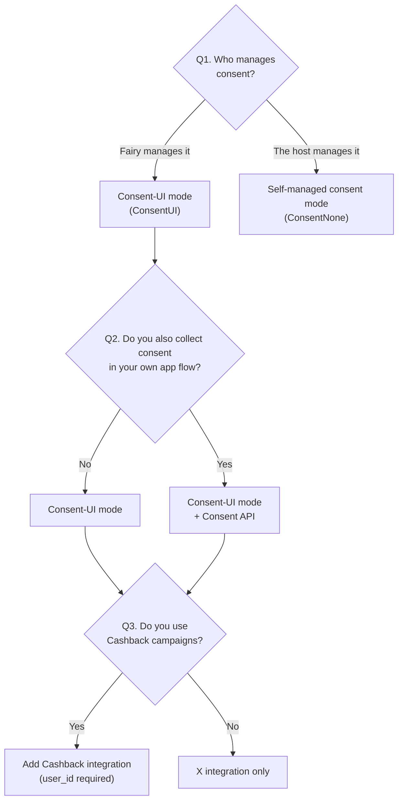

How you integrate the Moment SDK depends on how consent is managed and which products you use. Answer the questions below in order to determine your setup.

<Note>
  Your integration setup is finalized together with Fairy during the contract/planning stage. If you're unsure, contact [eng@fairytech.ai](mailto:eng@fairytech.ai).
</Note>

## Decision tree

### Q1. If you use X — who manages the service consent?

- **Q1 — Who manages consent**: If Fairy manages the legal consent (Terms of Service, personal-information collection/use, etc.), you are in **Consent-UI mode (ConsentUI)**. If you manage it yourself, you are in **self-managed consent mode (ConsentNone)**.
- **Q2 — Consent API (ConsentAPI)**: Only for Consent-UI mode customers who also collect consent in their own app screens (e.g., a signup flow) and want to push it into the SDK.
- **Q3 — Cashback**: Cashback requires **Consent-UI mode \+ a `user_id`**. It is not available in self-managed consent mode.
- **Sigma is an independent axis**: It can be combined with any of the above, or used on its own. Sigma has no consent concept — you only call `setMarketingPushEnabled`.

## Guides by setup

| Setup | Guide |
| :-- | :-- |
| Consent-UI mode | [Integrate with the Consent UI (launchUI)](/en/dev-guide/x/launch-ui) |
| Consent-UI mode \+ Consent API | [Consent API](/en/dev-guide/x/consent-api) |
| Self-managed consent mode | [Direct integration (start / stop)](/en/dev-guide/x/direct) |
| Sigma | [Sigma Integration](/en/dev-guide/sigma-targeting/setup) |
| X \+ Sigma combinations | [Using X and Sigma Together](/en/dev-guide/x-with-sigma) |
| Cashback | [Cashback Product Introduction](/en/dev-guide/cashback/product-intro) |