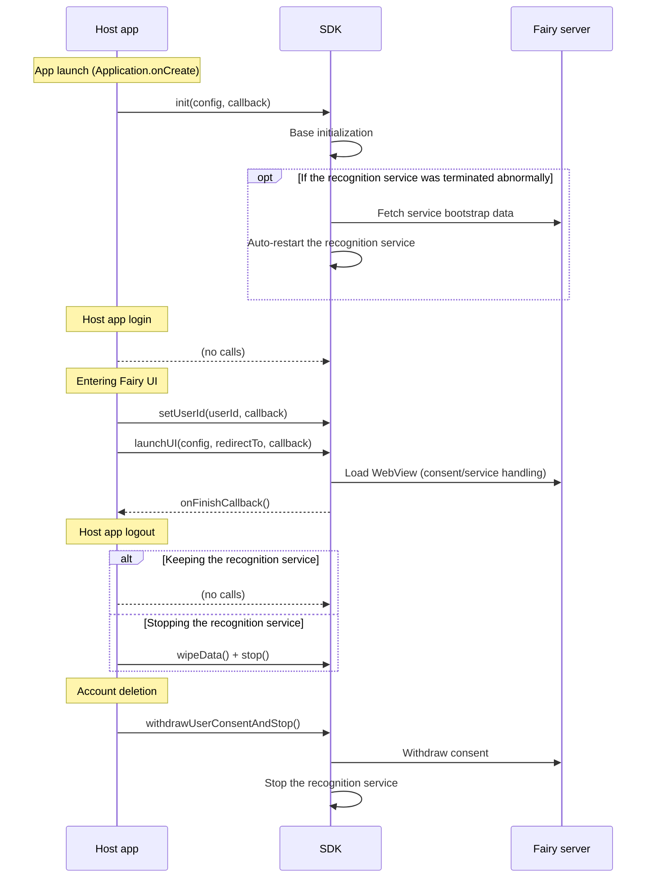
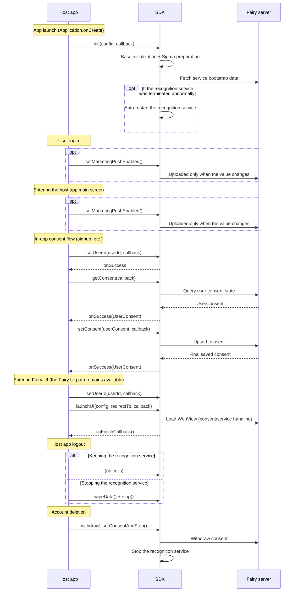
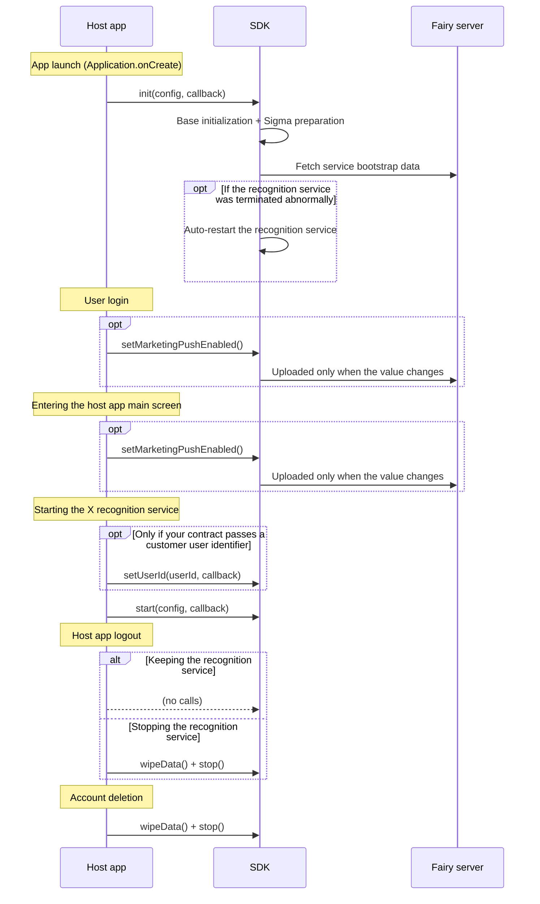
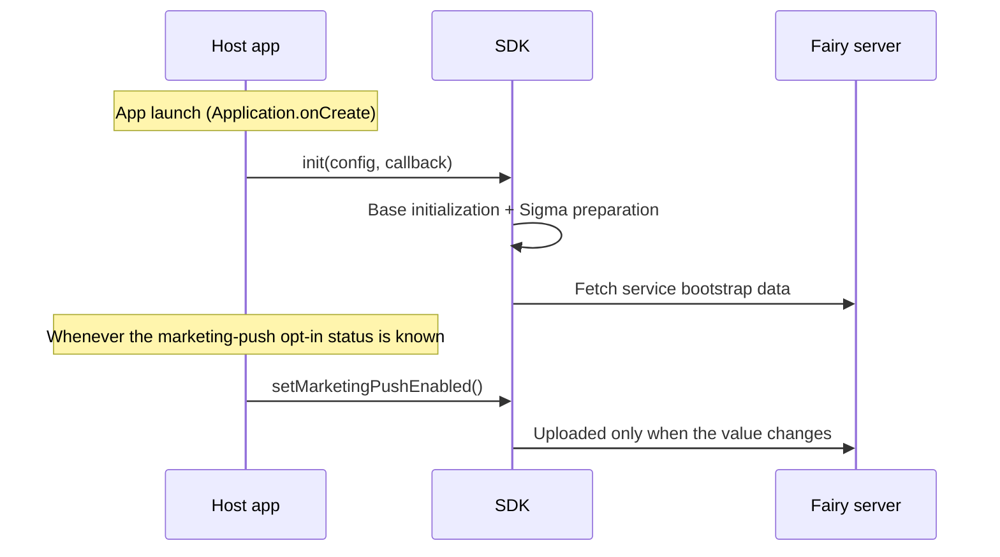

This page summarizes the four representative setups when using X and Sigma together (or on their own), with the full call sequence for each.

| # | Setup | Description |
| :-- | :-- | :-- |
| 1 | Consent-UI mode (X only) | Legal consent collected through Fairy's UI |
| 2 | Consent-UI mode \+ Consent API \+ Sigma | Consent also collected in your own app flow, with Sigma enabled |
| 3 | Self-managed consent mode \+ Sigma | You manage consent and only call start/stop, with Sigma enabled |
| 4 | Sigma only | Audience targeting only |

<Note>
  For terminology, see [Product Overview \> Key terminology](/en/dev-guide/getting-started/overview#key-terminology). To pick a setup, see [Find Your Integration Setup](/en/dev-guide/getting-started/find-your-setup).
</Note>

## 1. Consent-UI mode (X only)

For details, see [Integrate with the Consent UI (launchUI)](/en/dev-guide/x/launch-ui).

## 2. Consent-UI mode \+ Consent API \+ Sigma

For details, see the [Consent API](/en/dev-guide/x/consent-api) and [Sigma Integration](/en/dev-guide/sigma-targeting/setup).

## 3. Self-managed consent mode \+ Sigma

For details, see [Direct integration (start / stop)](/en/dev-guide/x/direct) and [Sigma Integration](/en/dev-guide/sigma-targeting/setup).

## 4. Sigma only

For details, see [Sigma Integration](/en/dev-guide/sigma-targeting/setup).