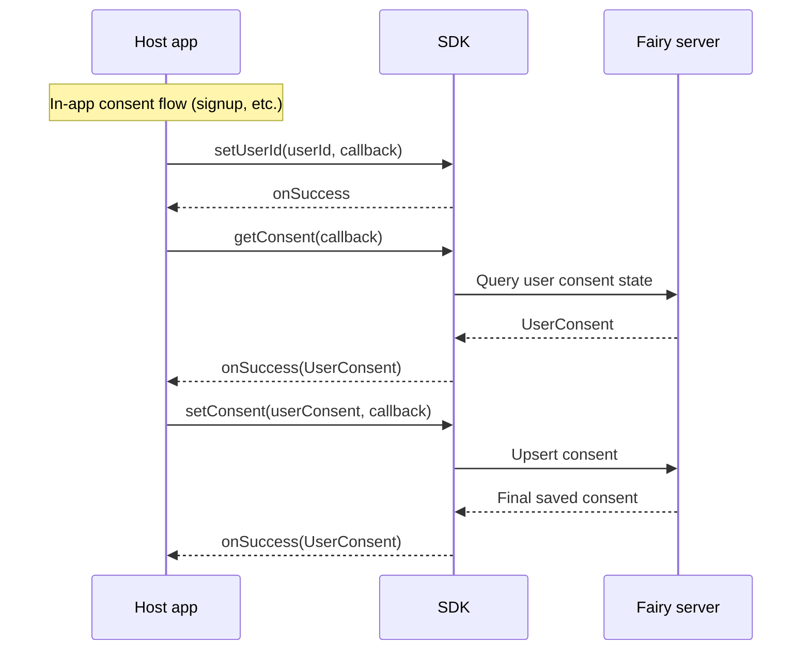

## Overview

The **Consent API (ConsentAPI)** is an optional add-on available only to customers using the [Consent-UI mode (ConsentUI)](/en/dev-guide/x/launch-ui) setup.

If you also collect Fairy service consent in your own app screens (e.g., a signup flow), use `getConsent` / `setConsent` to query and save the user's consent. The Fairy UI consent path (`launchUI`) remains available as-is.

<Warning>
  The Consent API is not available in self-managed consent mode (ConsentNone). Calling it there invokes the `onFailure` callback.
</Warning>

## Supported consent items

| Field | Title | Notes |
| :-- | :-- | :-- |
| `agreeTermsOfService` | Terms of Service consent |  |
| `agreePersonalInfoUseAndSharing` | Personal information collection/use and third-party sharing consent |  |
| `agreeMarketingInfoReceive` | Marketing communications consent | Consent to receive cashback and ad notifications. Notifications are not sent without it. |
| `agreeMarketingPersonalInfoUseAndSharing` | Marketing-purpose personal info processing consent | Consent to use service usage data to send cashback/ad notifications. Notifications are not sent without it. |
| `agreeNighttimeNotification` | Nighttime (21:00–08:00) notification consent | Without it, no notifications are sent at night. |

<Tip>
  The Consent API stores and queries consent keyed by the currently set `userId`. Always call `setUserId()` before calling the Consent API. If userId is empty, the call fails.
</Tip>

## Call sequence

Call in the following order from your own consent flow (signup, etc.).



## Usage examples

### 0. Preliminary setup

Set the userId via `setUserId()` before calling the Consent API.

```kotlin
val moment = MomentSDK.getInstance(context)
moment.setUserId("test-user-id", object : MomentSDK.ResultCallback {
    override fun onSuccess() {
        // Once userId is set, call the Consent API
    }
    override fun onFailure(exception: MomentException) {}
})
```

### 1. Query consent state (`getConsent`)

```kotlin
moment.getConsent(object : MomentSDK.CallbackWithResult<GetUserConsentResponse> {
    override fun onSuccess(result: GetUserConsentResponse) {
        binding.swConsentTos.isChecked = result.agreeTermsOfService
        binding.swConsentPersonalInfo.isChecked = result.agreePersonalInfoUseAndSharing
        binding.swConsentMarketingInfo.isChecked = result.agreeMarketingInfoReceive
        binding.swConsentMarketingPersonal.isChecked = result.agreeMarketingPersonalInfoUseAndSharing
        binding.swConsentNighttimeNoti.isChecked = result.agreeNighttimeNotification
    }

    override fun onFailure(exception: MomentException) {
        Log.e("Consent", "getConsent failed: ${exception.errorCode}")
    }
})
```

### 2. Save consent (`setConsent`)

```kotlin
val request = SubmitUserConsentRequest.newBuilder()
    .setAgreeTermsOfService(true)
    .setAgreePersonalInfoUseAndSharing(true)
    .setAgreeMarketingInfoReceive(binding.swConsentMarketingInfo.isChecked)
    .setAgreeMarketingPersonalInfoUseAndSharing(binding.swConsentMarketingPersonal.isChecked)
    .setAgreeNighttimeNotification(binding.swConsentNighttimeNoti.isChecked)
    .build()

moment.setConsent(request, object : MomentSDK.CallbackWithResult<SubmitUserConsentResponse> {
    override fun onSuccess(result: SubmitUserConsentResponse) {
        binding.swConsentTos.isChecked = result.agreeTermsOfService
        binding.swConsentPersonalInfo.isChecked = result.agreePersonalInfoUseAndSharing
        binding.swConsentMarketingInfo.isChecked = result.agreeMarketingInfoReceive
        binding.swConsentMarketingPersonal.isChecked = result.agreeMarketingPersonalInfoUseAndSharing
        binding.swConsentNighttimeNoti.isChecked = result.agreeNighttimeNotification
    }

    override fun onFailure(exception: MomentException) {
        Log.e("Consent", "setConsent failed: ${exception.errorCode}")
    }
})
```

<Warning>
  Even to change only a few fields, you must re-specify every field with its current value (e.g., the value from `getConsent` or the current UI state). Any field you don't specify is saved as `false`.
</Warning>

### 3. Withdraw consent

When you need to withdraw all consents (e.g., account deletion), call `withdrawUserConsentAndStop()`. All consents are withdrawn and the recognition service stops as well.

```kotlin
moment.withdrawUserConsentAndStop(object : MomentSDK.ResultCallback {
    override fun onSuccess() {}

    override fun onFailure(exception: MomentException) {
        Log.e("Consent", "withdrawUserConsentAndStop failed: ${exception.errorCode}")
    }
})
```

<Danger>
  `withdrawUserConsentAndStop` withdraws **all** consents including `agreeTermsOfService` and stops the recognition service. To revoke only some consents, use `setConsent` and set only the desired fields to `false`.
</Danger>

## Reference

For detailed references to methods, callbacks, and data types, see the [Android API](/en/api/android) docs.