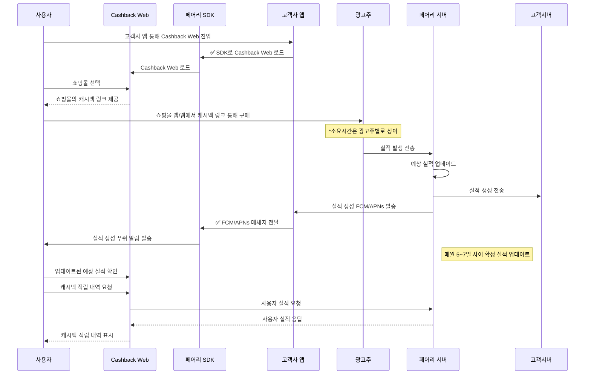
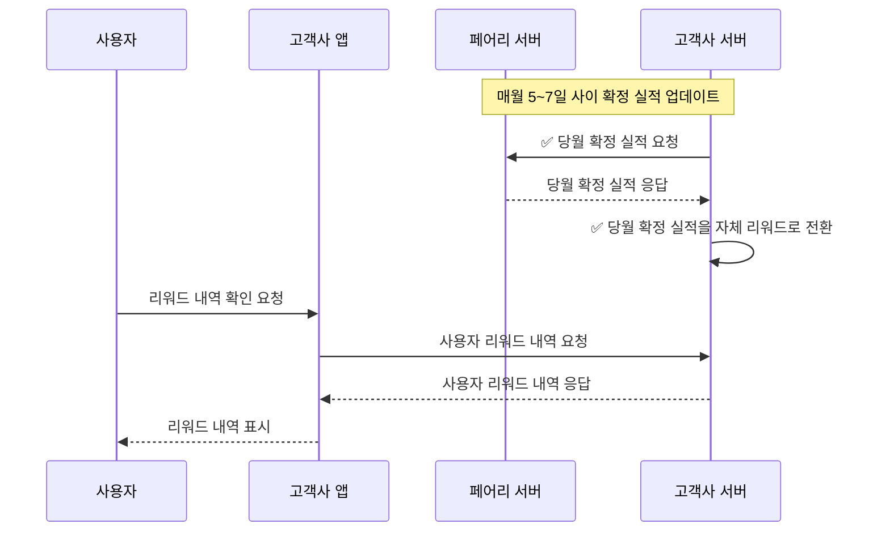

페어리의 캐시백 솔루션은 고객사 앱에 손쉽게 연동할 수 있는 \*\*4가지 주요 컴포넌트(Cashback Web, Android SDK, Server API, Web Console)\*\*로 구성되어 있습니다.

<Note>
  Cashback은 **X의 동의 화면 제공형(ConsentUI) 연동과 `user_id` 설정을 전제**로 동작합니다. 동의 자체 관리형(ConsentNone) 구성에서는 Cashback을 사용할 수 없습니다. 자세한 내용은 [내 연동 구성 찾기](/ko/dev-guide/getting-started/find-your-setup)를 참고하세요.
</Note>

사용자는 쇼핑 여정 안에서 자연스럽게 캐시백 혜택을 받을 수 있고, 고객사는 앱 내 전환율과 사용자 만족도를 높일 수 있습니다.

## 1. Cashback Web

> 캐시백 정보 탐색부터 적립 가능한 제휴처 링크까지 연결하는 통합형 웹 서비스

Cashback Web은 다양한 제휴 쇼핑몰 및 브랜드의 캐시백 정보를 사용자에게 제공하는 **웹 기반 서비스**입니다. 고객사 앱 내에서 **WebView로 연동**하면, 별도 **SDK 도입 없이** 다음과 같은 기능을 빠르게 도입할 수 있습니다.

- **캐시백 프로그램 리스트 조회**: 다양한 제휴 쇼핑몰 및 브랜드의 캐시백 혜택을 한눈에 확인할 수 있습니다.
- **캐시백 조건 상세 조회**: 각 제휴처별 캐시백 조건(적립률, 유효기간 등)을 상세히 안내합니다.
- **캐시백 링크 제공**: 조건을 확인한 후 제휴몰로 직접 이동해 쇼핑할 수 있는 링크를 제공합니다.
- **캐시백 구매 직후 알림 :** 사용자가 구매후 바로 캐시백이 적립되었는지 확인할 수 있습니다.
- **적립 내역 확인**: 사용자가 본인이 적립받은 캐시백 내역을 조회할 수 있습니다.
- **고객센터 문의 기능**: 적립 관련 문의를 간편하게 접수할 수 있습니다.

## 2. Android/iOS SDK

> 손쉽은 Cashback Web 연동 기능 제공 및 (Android Only) 사용자의 앱 진입을 감지하여 푸쉬 알림으로 캐시백 혜택을 자연스럽게 안내

(Android Only) **사용자의 앱 진입을 실시간으로 인식**하여 캐시백 혜택을 안내하는 **푸쉬 알림** 기능까지 지원합니다.

- **앱 진입 감지**: 사용자가 특정 쇼핑 앱에 진입했는지 감지합니다.
- **자동 알림 전송**: 해당 시점에 적절한 캐시백 혜택을 푸쉬 알림으로 안내합니다.
- **Cashback Web 연동 편의 메서드 제공**: WebView를 직접 띄우는 로직 없이, SDK 메서드 호출만으로 Cashback Web 화면을 열 수 있습니다.

## 3. Server API

> 고객사의 서버 시스템과 직접 연동하여 실적 기반 리워드 자동 지급이 가능하도록 지원

페어리는 B2B 환경에서 **실시간 콜백 및 정산용 API**를 제공하여, 고객사가 자체 리워드 시스템과 안정적으로 연동할 수 있도록 지원합니다.

- **실시간 콜백**: 사용자의 캐시백 실적이 발생한 경우, 해당 정보를 실시간으로 고객사 서버에 전달합니다.
- **정산용 확정 실적 조회 API**: 매월 정산 시점에 확정된 실적 정보를 조회할 수 있어, 고객사가 사용자에게 지급해야 할 보상을 정확하게 계산할 수 있습니다. 고객사가 포인트/쿠폰 등 자체 리워드 시스템을 운영하는 경우, 이 API를 통해 월별 리워드 지급 프로세스를 자동화할 수 있습니다.

## **캐시백 적립 및 실적 생성·확인 시나리오**

(✅: 개발 필요한 부분)

## 연동작업

### \[앱\] Cashback Web 연동

> 다이어그램에서 ✅ SDK로 Cashback Web 로드 에 해당하는 부분입니다.

앱 내에서 Cashback Web 화면을 사용자에게 보여주고 실적 알림 등을 받기 위해 SDK를 통한 Cashback Web 연동이 필요합니다.

- 🔗 [Android 연동하기](/ko/dev-guide/cashback/android)
- 🔗 [iOS (Swift) 연동하기](/ko/dev-guide/cashback/ios)

### (Optional) \[서버\] 자체 리워드 전환 기능 개발

고객사에서 매월 확정된 캐시백 실적을 자체 리워드(예: 자체 재화, 쿠폰 등)로 전환하고자 하는 경우, 페어리에서 제공하는 **확정 실적 조회 API**를 활용해 실적 데이터를 조회하고, 이를 기반으로 리워드 전환 처리를 수행하셔야 합니다.

**매월 정산일(예: 5~7일경) 시점에 배치 작업 또는 정기 스케줄러를 통해 API를 호출**하여, 해당 월의 확정된 실적을 조회하고 전환 로직을 실행하는 방식으로 구현하실 수 있습니다.

#### 확정 실적 기반 고객사 리워드 전환 및 사용자 조회 시나리오

(✅: 개발 필요한 부분)

- \[서버\] ✅ 당월 확정 실적 요청
  - [API 명세서](/ko/api/server) 에서 확정실적 조회 API spec을 확인하실 수 있습니다.