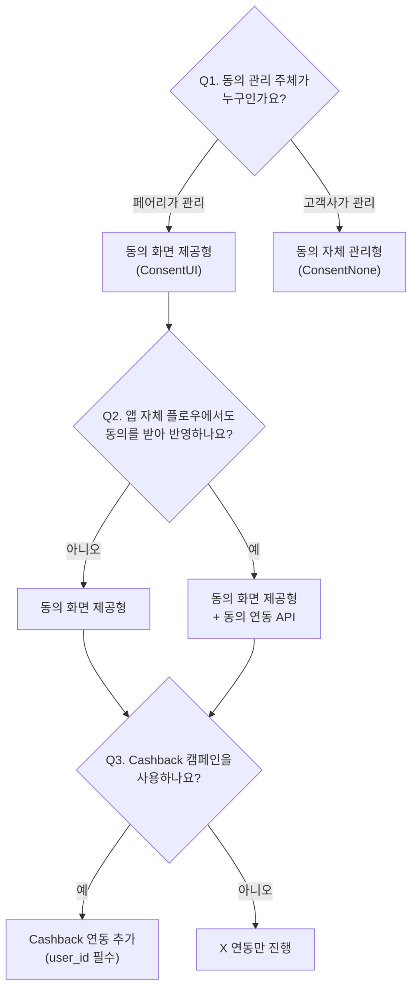

Moment SDK는 고객사의 동의 관리 방식과 사용 제품 조합에 따라 연동 방법이 달라집니다. 아래 질문에 차례로 답하면 우리 서비스에 맞는 구성이 정해집니다.

<Note>
  연동 구성은 계약/기획 단계에서 페어리와 함께 확정됩니다. 구성이 불분명하다면 [eng@fairytech.ai](mailto:eng@fairytech.ai)로 문의해주세요.
</Note>

## 결정 트리

### Q1. X를 사용한다면 — 서비스 이용 동의를 누가 관리하나요?

- **Q1 — 동의 관리 주체**: 법적 동의(서비스 이용약관, 개인정보 수집·이용 등)를 페어리가 관리하면 **동의 화면 제공형(ConsentUI)**, 고객사가 자체 관리하면 **동의 자체 관리형(ConsentNone)** 입니다.
- **Q2 — 동의 연동 API(ConsentAPI)**: 동의 화면 제공형 고객사 중, 가입 플로우 등 앱 자체 화면에서 동의를 한 번 더 받아 SDK로 반영하려는 경우에만 추가합니다.
- **Q3 — Cashback**: Cashback은 **동의 화면 제공형 \+ `user_id` 설정을 전제**로 동작합니다. 동의 자체 관리형에서는 Cashback을 사용할 수 없습니다.
- **Sigma는 별도 축입니다**: 위 어떤 구성과도 함께 쓸 수 있고, Sigma만 단독으로 사용할 수도 있습니다. Sigma는 동의 개념 없이 `setMarketingPushEnabled` 만 호출합니다.

## 구성별 가이드 바로가기

| 구성 | 가이드 |
| :-- | :-- |
| 동의 화면 제공형 | [동의 화면으로 연동하기 (launchUI)](/ko/dev-guide/x/launch-ui) |
| 동의 화면 제공형 \+ 동의 연동 API | [동의 연동 API](/ko/dev-guide/x/consent-api) |
| 동의 자체 관리형 | [직접 연동하기 (start / stop)](/ko/dev-guide/x/direct) |
| Sigma | [Sigma 연동하기](/ko/dev-guide/sigma-targeting/setup) |
| X \+ Sigma 조합 | [X \+ Sigma 함께 쓰기](/ko/dev-guide/x-with-sigma) |
| Cashback | [Cashback 제품 소개](/ko/dev-guide/cashback/product-intro) |