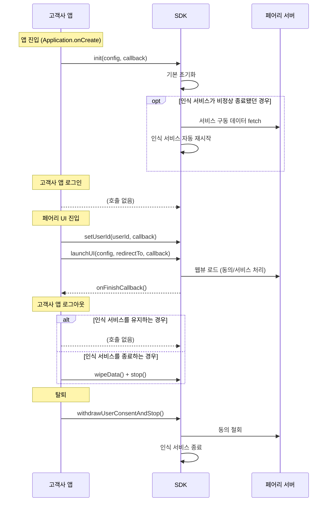
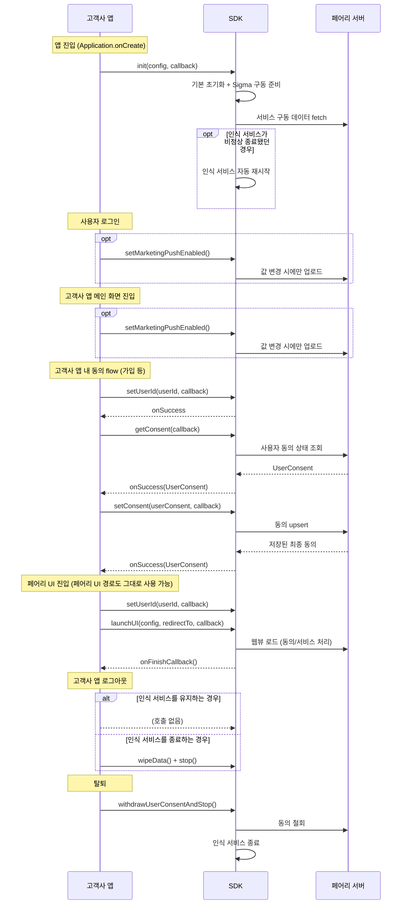
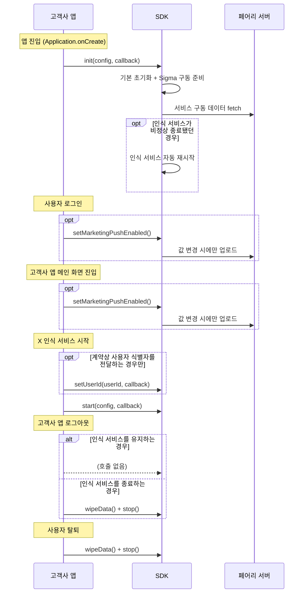
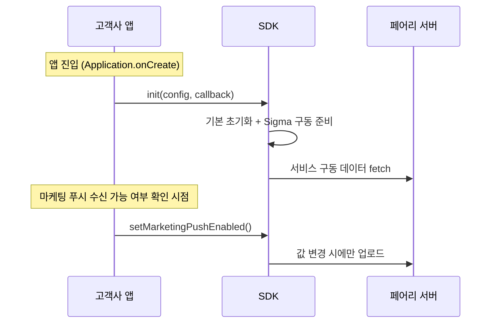

X와 Sigma를 함께, 혹은 단독으로 사용할 때의 대표 구성 4가지와 각 구성의 전체 호출 순서를 정리합니다.

| # | 구성 | 설명 |
| :-- | :-- | :-- |
| 1 | X (동의 화면 제공형) | 법적 동의를 페어리 UI로 수집 |
| 2 | X (동의 화면 제공형 \+ 동의 연동 API) \+ Sigma | 앱 자체 플로우에서도 동의를 받아 반영하고, Sigma도 함께 사용 |
| 3 | X (동의 자체 관리형) \+ Sigma | 동의는 고객사가 관리하고 start/stop만 호출, Sigma도 함께 사용 |
| 4 | Sigma | 모수 타겟팅만 사용 |

<Note>
  용어 정의는 [제품 개요 \> 핵심 용어](/ko/dev-guide/getting-started/overview#핵심-용어)를, 구성 선택은 [내 연동 구성 찾기](/ko/dev-guide/getting-started/find-your-setup)를 참고하세요.
</Note>

## 1. 동의 화면 제공형 (X 단독)

자세한 연동 방법은 [동의 화면으로 연동하기 (launchUI)](/ko/dev-guide/x/launch-ui)를 참고하세요.

## 2. 동의 화면 제공형 \+ 동의 연동 API \+ Sigma

자세한 연동 방법은 [동의 연동 API](/ko/dev-guide/x/consent-api)와 [Sigma 연동하기](/ko/dev-guide/sigma-targeting/setup)를 참고하세요.

## 3. 동의 자체 관리형 \+ Sigma

자세한 연동 방법은 [직접 연동하기 (start / stop)](/ko/dev-guide/x/direct)와 [Sigma 연동하기](/ko/dev-guide/sigma-targeting/setup)를 참고하세요.

## 4. Sigma 단독

자세한 연동 방법은 [Sigma 연동하기](/ko/dev-guide/sigma-targeting/setup)를 참고하세요.