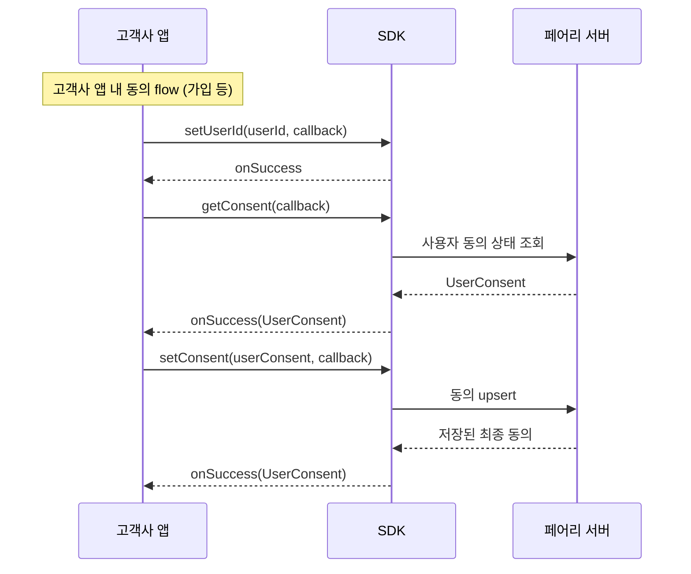

## 개요

**동의 연동 API(ConsentAPI)** 는 [동의 화면 제공형(ConsentUI)](/ko/dev-guide/x/launch-ui) 구성을 사용하는 고객사에게만 추가로 제공되는 옵션입니다.

가입 플로우 등 고객사 앱의 자체 화면에서 페어리 서비스 동의를 함께 받는 경우, `getConsent` / `setConsent` 메서드로 동의 정보를 조회·저장할 수 있습니다. 페어리 UI를 통한 동의 수집 경로(`launchUI`)도 그대로 유지됩니다.

<Warning>
  동의 자체 관리형(ConsentNone) 구성에서는 동의 연동 API를 사용할 수 없습니다. 호출 시 `onFailure` 콜백이 호출됩니다.
</Warning>

## 지원하는 동의 항목

| 필드 | Title | 비고 |
| :-- | :-- | :-- |
| `agreeTermsOfService` | 서비스 이용약관 동의 |  |
| `agreePersonalInfoUseAndSharing` | 개인정보 수집·이용 및 제3자 제공 동의 |  |
| `agreeMarketingInfoReceive` | 마케팅 정보 수신 동의 | 캐시백 및 광고 알림에 대한 수신 동의입니다. 미동의 시 알림이 나가지 않습니다. |
| `agreeMarketingPersonalInfoUseAndSharing` | 마케팅 목적 개인정보 수집·이용·제공 동의 | 캐시백 및 광고 알림을 보내기 위해 서비스이용기록을 이용한다는 개인정보 동의입니다. 미동의 시 알림이 나가지 않습니다. |
| `agreeNighttimeNotification` | 야간(21:00~08:00) 알림 수신 동의 | 미동의 시 야간에 알림이 나가지 않습니다. |

<Tip>
  동의 연동 API는 현재 설정된 `userId` 를 키로 사용하여 동의 정보를 저장·조회합니다. 반드시 `setUserId()` 로 userId를 먼저 설정한 뒤 호출해주세요. userId가 비어 있는 상태로 호출하면 실패 콜백이 호출됩니다.
</Tip>

## 호출 순서

앱 자체 동의 플로우(가입 등)에서 아래 순서로 호출합니다.



## 사용 예시

### 0. 사전 설정

동의 연동 API 호출 전에 `setUserId()` 로 userId를 설정합니다.

```kotlin
val moment = MomentSDK.getInstance(context)
moment.setUserId("test-user-id", object : MomentSDK.ResultCallback {
    override fun onSuccess() {
        // userId 설정 완료 후 동의 연동 API 호출
    }
    override fun onFailure(exception: MomentException) {}
})
```

### 1. 동의 상태 조회 (`getConsent`)

```kotlin
moment.getConsent(object : MomentSDK.CallbackWithResult<GetUserConsentResponse> {
    override fun onSuccess(result: GetUserConsentResponse) {
        binding.swConsentTos.isChecked = result.agreeTermsOfService
        binding.swConsentPersonalInfo.isChecked = result.agreePersonalInfoUseAndSharing
        binding.swConsentMarketingInfo.isChecked = result.agreeMarketingInfoReceive
        binding.swConsentMarketingPersonal.isChecked = result.agreeMarketingPersonalInfoUseAndSharing
        binding.swConsentNighttimeNoti.isChecked = result.agreeNighttimeNotification
    }

    override fun onFailure(exception: MomentException) {
        Log.e("Consent", "getConsent failed: ${exception.errorCode}")
    }
})
```

### 2. 동의 저장 (`setConsent`)

```kotlin
val request = SubmitUserConsentRequest.newBuilder()
    .setAgreeTermsOfService(true)
    .setAgreePersonalInfoUseAndSharing(true)
    .setAgreeMarketingInfoReceive(binding.swConsentMarketingInfo.isChecked)
    .setAgreeMarketingPersonalInfoUseAndSharing(binding.swConsentMarketingPersonal.isChecked)
    .setAgreeNighttimeNotification(binding.swConsentNighttimeNoti.isChecked)
    .build()

moment.setConsent(request, object : MomentSDK.CallbackWithResult<SubmitUserConsentResponse> {
    override fun onSuccess(result: SubmitUserConsentResponse) {
        binding.swConsentTos.isChecked = result.agreeTermsOfService
        binding.swConsentPersonalInfo.isChecked = result.agreePersonalInfoUseAndSharing
        binding.swConsentMarketingInfo.isChecked = result.agreeMarketingInfoReceive
        binding.swConsentMarketingPersonal.isChecked = result.agreeMarketingPersonalInfoUseAndSharing
        binding.swConsentNighttimeNoti.isChecked = result.agreeNighttimeNotification
    }

    override fun onFailure(exception: MomentException) {
        Log.e("Consent", "setConsent failed: ${exception.errorCode}")
    }
})
```

<Warning>
  일부 항목만 변경하고 싶은 경우에도, 변경하지 않는 항목은 현재 값(예: `getConsent` 로 조회한 값 또는 UI에 표시되는 스위치 상태)을 그대로 다시 지정해 주어야 합니다. 지정하지 않은 필드는 `false` 로 저장됩니다.
</Warning>

### 3. 동의 철회

사용자 탈퇴 등으로 모든 동의를 철회해야 하는 경우 `withdrawUserConsentAndStop()` 을 호출합니다. 모든 동의가 철회되고 인식 서비스도 함께 종료됩니다.

```kotlin
moment.withdrawUserConsentAndStop(object : MomentSDK.ResultCallback {
    override fun onSuccess() {}

    override fun onFailure(exception: MomentException) {
        Log.e("Consent", "withdrawUserConsentAndStop failed: ${exception.errorCode}")
    }
})
```

<Danger>
  `withdrawUserConsentAndStop` 은 `agreeTermsOfService` 를 포함한 **모든** 동의를 철회하고 인식 서비스를 종료합니다. 일부 동의만 해제하려면 `setConsent` 를 사용해 원하는 필드만 `false` 로 지정해 호출해 주세요.
</Danger>

## Reference

method, callback, data 등 상세 레퍼런스는 [Android API](/ko/api/android) 문서를 참조하세요.